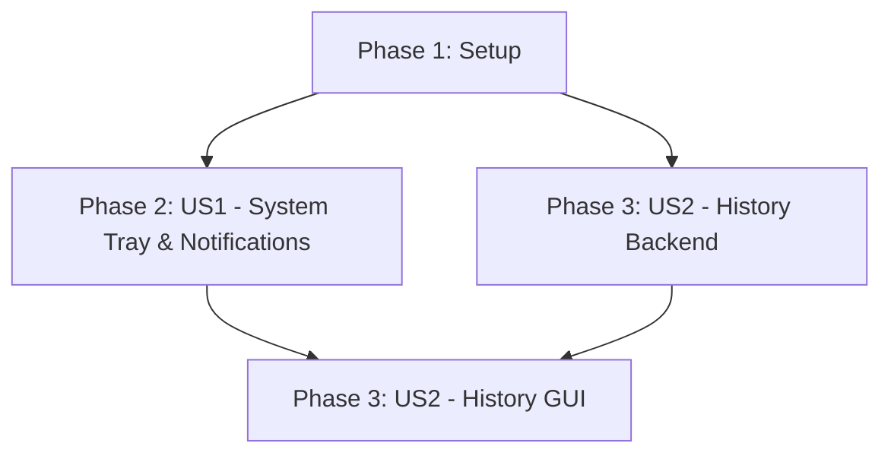

# Implementation Tasks: Background Execution & History Dashboard

**Feature**: `005-tray-and-history`
**Spec**: [spec.md](./spec.md) | **Plan**: [plan.md](./plan.md)

## Strategy

**MVP Scope**: Phase 1 and Phase 2. This delivers the core value proposition of background execution and system tray persistence combined with native OS notifications. The History feature (Phase 3) is a fast-follow increment.

**Incremental Delivery**:
1. Implement basic tray icon and minimize-to-tray.
2. Integrate native notifications and connect them to application state.
3. Build the backend history data model and persistence mechanism.
4. Construct the GUI History tab and connect the data model to the UI.

## Dependencies

## Phase 1: Setup

These tasks establish the required dependencies and architecture before feature work begins.

- [x] T001 Update `requirements.txt` with `pystray`, `Pillow`, and `desktop-notifier`
- [x] T002 Create infrastructure file bounds: `core/tray.py`, `core/notifications.py`, `core/history/manager.py`, `core/history/models.py`, `gui/tabs/history_tab.py`

## Phase 2: User Story 1 - Native Notifications for Background Tasks (P1)

**Goal**: Allow the application to run in the background (via system tray) and fire native OS notifications on task completion, which can restore the application.

**Independent Test Criteria**: 
- Minimize the application; it should disappear from the taskbar and appear in the system tray.
- Right-click the tray icon; verify "Restore", "Settings", and "Quit/Exit" work.
- Start a mock download; verify a native notification appears on completion.
- Click the notification; verify the application restores to the foreground.

**Implementation**:
- [x] T003 [P] [US1] Implement `SystemTrayIntegration` class in `core/tray.py` providing setup, right-click context menu, and click-to-restore behavior.
- [x] T004 [P] [US1] Implement `NotificationDispatcher` in `core/notifications.py` using `desktop-notifier` supporting `asyncio` event loop management for click callbacks.
- [x] T005 [US1] Modify `gui/main_window.py` to intercept `WM_DELETE_WINDOW` and call system tray hide/minimize logic instead of exiting.
- [x] T006 [US1] Integrate `core/notifications.py` into the download/conversion completion handlers within `gui/main_window.py` (or corresponding worker threads, ensuring async safety).
- [x] T007 [US1] Implement gracefully fallback in `gui/main_window.py` or `core/notifications.py` (e.g., standard `tkinter.messagebox`) if `desktop-notifier` throws an exception due to globally disabled OS notifications.
- [x] T008 [US1] Connect notification click callback to restore `gui/main_window.py` and focus the correct tab.

- [x] Phase 3: User Story 2 - History Dashboard (P2)

**Goal**: Provide a persistent "History" tab displaying up to 10 recent tasks with functionality to physically open or play the resulting files.

**Independent Test Criteria**:
- Open the application and check the History tab; it should display recent tasks.
- Complete a new task; it should appear immediately at the top of the History tab.
- Click "Play" on a history item; the default system player should open it.
- Click "Open Folder"; the system explorer should highlight the file.
- Click "Clear All History"; the list should visually empty and clear disk storage.

**Implementation**:
- [x] T009 [P] [US2] Define `HistoryItem` dataclass in `core/history/models.py`.
- [x] T010 [P] [US2] Implement `HistoryManager` in `core/history/manager.py` with 10-item JSON file persistence, load/save logic, and `clear_all` method.
- [x] T011 [US2] Implement `HistoryTab` UI component in `gui/tabs/history_tab.py` with a chronological list view and "Open Folder" / "Play" actions per row.
- [x] T012 [US2] Add the "Clear All History" button to `gui/tabs/history_tab.py` and wire it to the manager.
- [x] T013 [US2] Integrate `HistoryTab` into the main application notebook within `gui/main_window.py`.
- [x] T014 [US2] Instrument task completion handlers (downloads/conversions) to push new `HistoryItem` instances to the `HistoryManager` and refresh the `HistoryTab`.

## Phase 4: Polish & Cross-Cutting

- [x] T015 Review GUI element padding and styling in the History tab to match application theme.
- [x] T016 Verify error handling if a historical file was deleted before the user clicks "Play" or "Open Folder".
- [x] T017 Test `pystray` icon shutdown reliability during application exit (`Quit/Exit` action).
